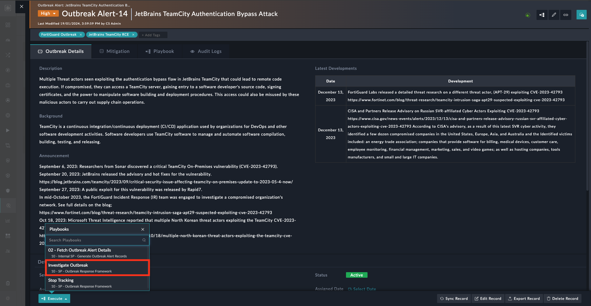

| [Home](../README.md) |
|----------------------|

# Usage

To investigate the alert, perform the following steps:

1. Under the FortiSOAR&trade;'s left navigation panel, hover over **Outbreak Management** and open **Outbreak Alerts**.

2. Click to open the record **JetBrains TeamCity Authentication Bypass Attack**.

3. Click the button **Execute**.

4. Select the **Investigate Outbreak** playbook to run and start the investigation.

# Next Steps

| [Installation](./setup.md#installation) | [Configuration](./setup.md#configuration) | [Contents](./contents.md) |
|-----------------------------------------|-------------------------------------------|---------------------------|